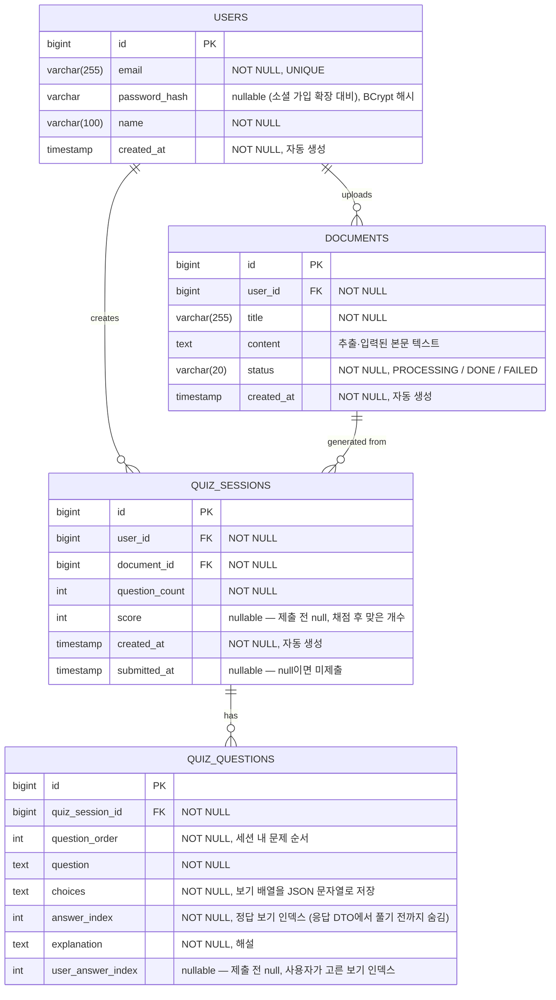

# ERD (데이터 모델링) — 학습자료 기반 스터디 챗봇

> 서비스에 필요한 데이터를 테이블로 나누고, 테이블 간 관계를 정의한 문서.
> **현재 실제 구현(JPA 엔티티) 기준**으로 작성되었다. 아래 다이어그램은 GitHub·Notion 등 mermaid를 지원하는 환경에서 그림으로 렌더링된다.

---

## 1. 테이블 목록

현재 PostgreSQL에 매핑되는 JPA 엔티티는 4개다.

| 테이블 | 엔티티 | 역할 |
|--------|--------|------|
| `users` | `User` | 회원 정보 |
| `documents` | `Document` | 업로드한 학습자료(텍스트·PDF 추출 본문 포함) |
| `quiz_sessions` | `QuizSession` | 자료에서 생성된 퀴즈 한 세트(풀이·채점 상태 포함) |
| `quiz_questions` | `QuizQuestion` | 퀴즈 세트 내 개별 문제(4지선다) |

> 청크·임베딩 벡터와 리프레시 토큰은 **PostgreSQL 테이블이 아니라 Redis**에 저장된다. → [4. DB 밖에 저장되는 데이터](#4-db-밖에-저장되는-데이터-redis) 참조.

---

## 2. 관계 표기법

mermaid ERD에서 선의 끝 모양이 관계를 나타낸다.

- `||` (막대 두 개) = "하나(one)"
- `o{` (까치발) = "여러 개(many)"
- 따라서 `USERS ||--o{ DOCUMENTS` = "사용자 한 명이 자료 여러 개를 가진다" (1:N)

키 표기:
- `PK` = Primary Key (기본 키)
- `FK` = Foreign Key (외래 키)

관계 요약:
- `User` 1 : N `Document` — 사용자가 자료 여러 개를 올린다
- `User` 1 : N `QuizSession` — 사용자가 퀴즈 세션 여러 개를 만든다
- `Document` 1 : N `QuizSession` — 한 자료로 여러 퀴즈 세션을 생성할 수 있다
- `QuizSession` 1 : N `QuizQuestion` — 한 세션은 여러 문제를 가진다

---

## 3. ERD

### 컬럼 상세

**`users`** (`User`)
- `email`: 고유(UNIQUE)·필수. 로그인 식별자.
- `password_hash`: BCrypt 해시. 소셜 로그인 확장을 대비해 nullable로 두었다(현재 자체 가입자는 항상 값이 있다).
- `created_at`: `@CreationTimestamp`로 INSERT 시 자동 기록, 수정 불가.

**`documents`** (`Document`)
- `user_id`: 소유자(`User`)에 대한 N:1 FK, 필수.
- `title` / `content`: 자료 제목과 본문. 텍스트 직접 입력 또는 PDF에서 추출한 텍스트가 `content`에 담긴다.
- `status`: `DocumentStatus` enum(`PROCESSING`, `DONE`, `FAILED`)을 문자열로 저장. 임베딩 처리 단계를 나타낸다.

**`quiz_sessions`** (`QuizSession`)
- `user_id`, `document_id`: 각각 `User`·`Document`에 대한 N:1 FK, 필수.
- `question_count`: 생성된 문제 수(3 / 5 / 10).
- `score`, `submitted_at`: 제출 전에는 둘 다 null. 제출·채점 시 맞은 개수와 제출 시각이 채워진다. `submitted_at != null`이 곧 "제출 완료" 상태다.

**`quiz_questions`** (`QuizQuestion`)
- `quiz_session_id`: `QuizSession`에 대한 N:1 FK, 필수(연관관계의 주인).
- `choices`: `List<String>`을 `StringListConverter`로 JSON 문자열(`["보기1","보기2","보기3","보기4"]`)로 직렬화해 단일 `TEXT` 컬럼에 저장한다.
- `answer_index`: 정답 보기 인덱스. 퀴즈를 풀기 전(생성 응답)에는 클라이언트에 내려보내지 않는다.
- `user_answer_index`: 사용자가 제출한 보기 인덱스. 미제출이면 null이며, 정답 일치 여부는 `user_answer_index == answer_index`로 판정한다.

### 연쇄 삭제

- `QuizSession` → `QuizQuestion`: `@OneToMany(cascade = ALL, orphanRemoval = true)`로 세션을 저장·삭제하면 딸린 문제들도 함께 처리된다.
- 자료(`Document`) 삭제 시, 해당 자료의 Redis 벡터 청크도 애플리케이션 로직에서 함께 정리한다.

---

## 4. DB 밖에 저장되는 데이터 (Redis)

다음 데이터는 관계형 테이블이 아니라 Redis에 저장되므로 위 ERD 본체에 포함하지 않는다.

### 4.1 자료 청크 · 임베딩 벡터 (Redis 벡터 스토어)

- 업로드된 자료 본문은 청킹·임베딩되어 **Spring AI Redis VectorStore**(RediSearch 인덱스)에 저장된다.
- 인덱스 이름: `study-chunks`, 키 접두사: `study-chunk:<uuid>` (앱 기동 시 인덱스 자동 생성).
- 임베딩 모델은 `gemini-embedding-001`(3072차원). RAG 질문 시 이 인덱스에서 유사 청크를 검색한다.
- 즉, 초기 설계의 `document_chunks` 테이블·`vector_ref` 컬럼은 **별도 RDB 테이블 없이 Redis 벡터 스토어로 대체**되었다.

### 4.2 리프레시 토큰 (Redis 문자열)

- 리프레시 토큰은 `StringRedisTemplate`으로 Redis에 저장된다.
- 키: `refresh:<email>`, 값: 리프레시 토큰 문자열, TTL: 리프레시 토큰 만료 시간(14일).
- 로그아웃 시 해당 키를 삭제하여 토큰을 무효화한다.

---

## 5. 향후 확장 시 고려

아직 구현되지 않은, 확장 단계에서 추가를 검토할 수 있는 테이블:

- `social_accounts` — 소셜 로그인(구글·카카오) 연결 정보 (`users.password_hash`를 nullable로 둔 이유)
- `conversations` / `messages` — 대화 세션·메시지 기록 저장
- `quiz_attempts` — 별도 풀이 시도 이력. (현재는 세션 단위로 `quiz_sessions.score`·`submitted_at`과 `quiz_questions.user_answer_index`에 결과를 보관하므로 별도 테이블이 없다.)

---

*이 문서는 살아있는 문서로, 개발 진행에 따라 갱신된다.*
